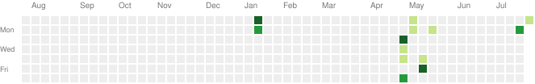

# 

<h1 align="center">Hi 👋, I'm Ahasan Habib Mallick</h1>

---

# 👨‍💻 About Me

<table>
<tr>

<td width="60%">

💻 SAP Backend Developer with a passion for designing scalable enterprise applications.

🎓 Computer Science Undergraduate.

🚀 Currently expanding my expertise in Backend Development using FastAPI & Django.

🌱 Learning SAP RAP Model, CDS Views, OData Services and Cloud Development.

💡 Passionate about solving real-world problems through clean architecture and efficient code.

🎯 Goal for 2026:

* SAP Certified Developer
* Master RAP Model
* Build 10+ Backend Projects
* Contribute to Open Source
* Improve DSA & System Design

⚡ Fun Fact:

> I enjoy transforming complex business requirements into elegant backend solutions.

</td>

<td>

</td>

</tr>
</table>

---

# 🌐 Connect With Me

---

# 💻 Tech Stack

### SAP Technologies

* SAP ABAP
* RAP Model
* CDS Views
* OData
* SAP S/4HANA Cloud
* SAP BTP (Learning)

---

# 📚 Currently Learning

* 🌱 Advanced SAP RAP Development
* 🚀 FastAPI Backend Development
* 🐳 Docker
* 🗄 PostgreSQL
* ⚡ System Design
* 📈 Data Structures & Algorithms

---

# 📊 GitHub Statistics

---

# 📈 GitHub Activity Graph

---

# 🐍 Contribution Snake

---

# 🔥 Contribution Heatmap

---

# 🏆 GitHub Trophies

---

# ⭐ Featured Projects

| Project                       | Description                                                |
| ----------------------------- | ---------------------------------------------------------- |
| 🚀 Portfolio Website          | Modern personal portfolio built using React & Tailwind CSS |
| 💼 SAP RAP Projects           | Enterprise applications using RAP Model                    |
| 📊 Employee Management System | CRUD application using FastAPI                             |
| 🔐 Authentication API         | JWT Authentication with FastAPI                            |
| 🌦 Weather App                | REST API based weather application                         |
| 🤖 Python Automation          | Useful automation scripts                                  |

> Replace these with your actual repositories and links.

---

# 📈 Contribution Stats

---

# 💬 Random Dev Quote

---

# 📌 2026 Goals

✅ SAP Certified Developer

✅ Master RAP Model

✅ Build SaaS Backend Projects

✅ Learn Kubernetes

✅ Contribute to Open Source

✅ 1000+ DSA Problems

---

# ⚙️ Tools I Use

---

# ❤️ Support

If you like my work, consider giving a ⭐ to my repositories.

---

### Thanks for visiting my profile ❤️

